---
title  Honeypot Predictive Deception
authors: 
  - name: Leonardo Barone
  - name: Leonardo Ciacco
  - name: Enrico Giannini

---

# HONEYPOT PREDICTIVE DECEPTION

An AI-powered honeypot system that uses LLM-based predictive analysis to dynamically deploy Canarytokens as traps, anticipating attacker behavior in real-time during SSH sessions.

--- 

This project implements a **predictive deception** system that enhances traditional honeypots with machine learning capabilities.  
When an attacker connects to the honeypot via SSH, the system:  

1. **Routes** the connection between two Cowrie instances
2. **Monitors** the attacker's command history in real-time
3. **Predicts** the attacker's next likely actions using a fine-tuned LLM (on the LLM-enabled instance)
4. **Deploys** targeted Canarytokens as traps before the attacker reaches them
5. **Alerts** when traps are triggered

## 1. Architecture

```mermaid
flowchart LR
  subgraph OUTSIDE["Outside"]
    direction TB
    ADMIN["Admin"]
    ATTACKER["Attacker"]
  end

  subgraph HOST["debian-HOST"]
    FSSH["SSH:4321"]
    P22["port 22"]
    P6453["port 6453"]

    subgraph CANARY["Canarytokens Docker"]
      direction TB
      NGINX["Nginx: 8008 Public"]
      FRONT["Frontend: 8082 Internal"]
      SWITCH["Switchboard"]
    end

    LLM["LLM Automation"]
    LISTENER["Listener:9000"]
    MONGO["MongoDB"]

    INGEST["Log Ingester"]:::ingester

    subgraph VM["debian-VM"]
      CONN_SWITCH["Connection Switcher: 2222"]:::switcher
      COWRIE_LLM["Cowrie:2223 with LLM"]:::honeypot
      COWRIE_STD["Cowrie:2224 standard"]:::honeypot_std
      REAL_SSH["SSH:22"]
      TOKEN_LLM["Canary File LLM"]:::canary
      TOKEN_STD["Canary File Standard"]:::canary
      COWRIE_JSON["cowrie.json log file"]:::logfile
    end
    LLM_ANCHOR[" "]:::spacer
    classDef spacer fill:transparent,stroke:transparent,color:transparent;

    CONN_SWITCH ~~~ LLM_ANCHOR
    LLM_ANCHOR ~~~ LLM
  end

  ADMIN -->|SSH 4321| FSSH
  ADMIN -->|SSH 6453| P6453
  ATTACKER -->|SSH 22| P22
  P22 -->|FORWARD| CONN_SWITCH
  CONN_SWITCH -->|Round-Robin| COWRIE_LLM
  CONN_SWITCH -->|Round-Robin| COWRIE_STD
  P6453 -->|FORWARD| REAL_SSH

  COWRIE_LLM -->|1. Attacker Commands| LLM
  LLM -->|2. Previsions| COWRIE_LLM
  COWRIE_LLM -->|3. Generate Token| FRONT
  FRONT -->|4. Return Token URL| COWRIE_LLM
  COWRIE_LLM -->|5. Create File| TOKEN_LLM

  COWRIE_STD -->|Generate Token| FRONT
  FRONT -->|Return Token URL| COWRIE_STD
  COWRIE_STD -->|Create File| TOKEN_STD

  TOKEN_LLM -.->|6. Attacker Opens| ATTACKER
  TOKEN_STD -.->|Attacker Opens| ATTACKER
  ATTACKER -.->|7. Trigger HTTP 8008| NGINX
  NGINX -->|Proxy| SWITCH
  SWITCH -->|8. Webhook POST| LISTENER
  LISTENER -->|9. Save| MONGO

  INGEST -->|SCP pull cowrie.json| REAL_SSH
  REAL_SSH -->|Read VM log file| COWRIE_JSON
  INGEST -->|Parse JSON Insert| MONGO

  classDef honeypot fill:#ffe6e6,stroke:#cc0000,stroke-width:2px,color:#660000
  classDef honeypot_std fill:#e6f3ff,stroke:#0066cc,stroke-width:2px,color:#003366
  classDef canary fill:#ffffcc,stroke:#ffcc00,stroke-width: 2px,color:#333
  classDef ingester fill:#e3f2fd,stroke:#0d47a1,color:#000
  classDef logfile fill:#f3e5f5,stroke:#6a1b9a,color:#000
  classDef switcher fill:#fff0e6,stroke:#ff6600,stroke-width: 2px,color:#663300

  style VM fill:#1f4b7a,stroke:#7fb3ff,stroke-width:2px,color:#ffffff
  style HOST fill:#4a4a4a,stroke:#a0a0a0,stroke-width:1px,color:#ffffff
  style CANARY fill:#333333,stroke:#00ff00,stroke-width:1px,color:#fff
  style LISTENER fill:#e0f2f1,stroke:#004d40,color:#000
  style MONGO fill:#e8f5e9,stroke:#1b5e20,color:#000
```



### Dual Cowrie Architecture

The system employs two separate Cowrie honeypot instances managed by a Connection Switcher: 

| Component               | Port | Description |
|-----------              |------|-------------|
| **Connection Switcher** | 2222 | Load balancer that distributes incoming SSH connections via round-robin |
| **Cowrie with LLM**     | 2223 | Honeypot with LLM-based predictive canary deployment |
| **Cowrie Standard**     | 2224 | Honeypot base, that can generate canarys via wget/curl |

This architecture allows **A/B testing** between LLM-enhanced and standard honeypot responses, permitting a **performance comparison** between the two.

## 2. Repository Structure

```
llm_based_predictive_deception/
├── README.md
├── adapters
│   ├── README.md
│   ├── gemma-3-12b/
│   │   └── ...
│   ├── gemma-3-12b-2k/
│   │   └── ...
│   ├── gemma-3-4b/
│   │   └── ...
│   ├── gemma-3-4b-pt/
│   │   └── ...
│   ├── gemma3_chat_template.jinja
│   └── startup_API_server.sh
├── canary
│   ├── README.md
│   ├── fetch-canary.py
│   └── list-mails.py
├── canarytokens-docker
│   ├── ...
├── dataset
│   ├── README.md
│   ├── enriched_data
│   │   ├── README.md
│   │   └── training_set.json
│   ├── pre_enrichment_data
│   │   ├── test.json
│   │   └── train.json
│   └── training_data
│       ├── README.md
│       ├── train.json
│       ├── train.jsonl
│       ├── val.json
│       └── val.jsonl
├── listener
│   ├── README.md
│   ├── listener9000.py
│   └── start-canary-listener-ingester.sh
├── mongoDB
│   ├── README.md
│   ├── save-cowrie-logs.py
│   └── view-alerts.py
├── scripts
│   ├── README.md
│   ├── batch_processing
│   │   ├── README.md
│   │   ├── data_distillation_prompts
│   │   │   ├── README.md
│   │   │   ├── trap_intent_prompt.md
│   │   │   └── usertask.txt
│   │   ├── prepare_batch_gcs_output.py
│   │   └── start_batch_work.py
│   ├── fine_tuning
│   │   ├── README.md
│   │   ├── unsloth_train_12B.py
│   │   ├── unsloth_train_4B.py
│   │   └── unsloth_train_4B_it.py
│   └── training_processing
│       ├── README.md
│       ├── collapse_hx.py
│       ├── parse_fromPC_toText.py
│       ├── parse_response_toJSON.py
│       ├── parse_toJSONL.py
│       ├── prompt_completition_format.py
│       ├── run_data_processing.sh
│       ├── sanitizer_B64.py
│       ├── sanitizer_hex.py
│       └── split.py
└── vm-with-cowrie-honeypot
    ├── README.md
    ├── connection_switcher.py
    ├── cowrie
    │   ├── ...
    │   ├── src
    │   │   ├── cowrie
    │   │   │   ├── __init__.py
    │   │   │   ├── commands
    │   │   │   │   ├── ...
    │   │   │   │   ├── chmod.py # Modified
    │   │   │   │   ├── curl.py  # Modified
    │   │   │   │   └── wget.py  # Modified
    │   │   │   ├── shell
    │   │   │   │   ├── ...
    │   │   │   │   ├── fs.py              # Modified
    │   │   │   │   ├── honeypot.py        # Modified
    │   │   │   │   └── templates          # Added
    │   │   │   │       └── template.json
    └── cowrie-standard
        ├── ...
```

## 3. Supported Trap Types

The system can deploy various types of Canarytokens based on predicted attacker intent:

| Trap Category | Template Examples | Detection Method |
|---------------|-------------------|------------------|
| **AWS Credentials**   | `AWS_CLI_DEFAULT`, `AWS_ENV_WEBAPP`, `AWS_PY_S3_UPLOADER`, `AWS_PY_LAMBDA_LEAK`, `AWS_INI_SERVICE`| AWS API monitoring |
| **Kubernetes**        | `K8S_USER_DEFAULT`, `K8S_CI_PIPELINE`, `K8S_ROOT_ADMIN`, `K8S_BACKUP_OLD`, `K8S_SERVICE_ACCOUNT`  | K8s API token monitoring |
| **WireGuard VPN**     | `VPN_WG_SERVER_IFACE`, `VPN_WG_MOBILE`, `VPN_WG_SEGMENTED` | VPN client activation |
| **HTTP Traps**        | `TRAP_BASH_LOGROTATE`, `TRAP_PY_POSTGRES_DUMP`, `TRAP_BASH_SYSCHECK` | Script execution callback |
| **Leak Files**        | `LEAK_PLAINTEXT_CREDS`, `LEAK_INFRA_INVENTORY`, `LEAK_APP_SECRETS`, `LEAK_DEV_SCRATCHPAD`, `LEAK_OPENVPN_LEGACY` | File access monitoring |
| **PDF Lures**         | `LURE_CONTEXT_PHISHING`, `LURE_CONTEXT_PROJECT`, `LURE_CONTEXT_HR` | PDF reader |
| **File Substitution** | `FILE_SUBSTITUTION_HTTP`  | Download detection |

---

## 4. Installation

The majority of the installation process is automated via two bash scripts:
1. **`setup_host.sh`**: Runs on the main VPS (Host), and sets up KVM, firewalls, database, docker, and launches the VM installer.
2. **`setup_vm.sh`**: Runs inside the Honeypot VM, and sets up the Cowrie instances, python environments, and the connection switcher.

### Prerequisites

A **host** machine, consisting of:
- Debian-based VPS with nested virtualization support (The **Host**)
- NVIDIA L4 GPU with 24GB vRAM (for LLM inference)
- At least 16GB RAM 
- Public IP address

---

### Phase 1: host setup

The `setup_host.sh` script automates the installation of KVM, libvirt, mongoDB, docker, canarytokens, and the webhook listener.  
It also configures `firewalld` for opening forwarding ports.

1. **Clone the repository on your host machine:**
```bash
git clone https://github.com/festus55/llm_based_predictive_deception/
cd llm_based_predictive_deception
```

2. **Run the Host Setup script:**
```bash
sudo ./setup_host.sh
```

3. **Install the VM OS manually:**
After the script will trigger `virt-install`, it opens a console to the VM, where you must perform the Debian installation manually.  
Configuration:  
* **Network:** static IP: `192.168.122.17`
* **Gateway:** `192.168.122.1`
* **Software selection:** Ensure **"SSH server"** is selected.
* **User:** Create a user named `person` 

> To detach from the console if needed, press `Ctrl+]`

---

### Phase 2: VM configuration

Once the VM is installed and running, you need to configure the internal honeypot logic.

1. **Transfer files to the VM:**
From your Host machine, copy the repository and the setup script to the VM:
```bash
# Note: Port 6453 on Host is forwarded to Port 22 on VM
scp -P 6453 -r $(pwd) person@192.168.122.17:/home/person/repo
scp -P 6453 setup_vm.sh person@192.168.122.17:/home/person/
```

connect to the VM:
`ssh -p 6453 person@192.168.122.17`

#### Connection Switcher Setup

```bash
scp vm-with-cowrie-honeypot/connection_switcher.py cowrie@<VM_IP>:/home/cowrie/
python3 connection_switcher.py &
```

#### Cowrie with LLM (Port 2223)

1. Update the system:
   ```bash
   sudo apt update && sudo apt upgrade -y
   ```

2. Install Cowrie dependencies:
   ```bash
   sudo apt install -y git python3-pip python3-venv libssl-dev libffi-dev \
       build-essential libpython3-dev python3-minimal authbind
   ```

3. Create the cowrie user and clone the repository:
   ```bash
   sudo adduser --disabled-password cowrie
   sudo su - cowrie

   git clone https://github.com/cowrie/cowrie cowrie-llm
   cd cowrie-llm
   ```

4. Set up the virtual environment:  
   ```bash
   python3 -m venv cowrie-env
   source cowrie-env/bin/activate

   pip install --upgrade pip
   pip install -e .
   
   # Install additional dependencies for LLM integration
   pip install treq pikepdf reportlab
   ```

5. Configure Cowrie to listen on port 2223:
   ```bash
   cp etc/cowrie. cfg.dist etc/cowrie.cfg
   # Edit etc/cowrie.cfg and set:
   # listen_endpoints = tcp: 2223:interface=0.0.0.0
   ```

6. **Install modified Cowrie components with LLM support** (from this repository):
   ```bash
   # Copy modified files to Cowrie installation
   cp scripts/cowrie_app/honeypot.py src/cowrie/shell/honeypot.py
   cp scripts/cowrie_app/fs. py src/cowrie/shell/fs.py
   cp scripts/cowrie_app/curl.py src/cowrie/commands/curl.py
   cp scripts/cowrie_app/wget.py src/cowrie/commands/wget.py
   cp scripts/cowrie_app/chmod.py src/cowrie/commands/chmod.py
   
   # Copy templates
   mkdir -p src/cowrie/shell/templates
   cp scripts/cowrie_app/cowrie_templates_master.json src/cowrie/shell/templates/template.json
   ```

7. Start Cowrie with LLM:
   ```bash
   cowrie start
   # To stop:  bin/cowrie stop
   ```

#### Standard Cowrie (Port 2224)

This instance is a standard Cowrie honeypot that can still generate canarys via wget/curl commands, but has **no LLM connection**.

1. Clone a separate Cowrie instance: 
   ```bash
   sudo su - cowrie
   git clone https://github.com/cowrie/cowrie cowrie-standard
   cd cowrie-standard
   ```

2. Set up the virtual environment:
   ```bash
   python3 -m venv cowrie-env
   source cowrie-env/bin/activate

   pip install --upgrade pip
   pip install -e .
   pip install treq pikepdf reportlab
   ```

3. Configure Cowrie to listen on port 2224:
   ```bash
   cp etc/cowrie.cfg.dist etc/cowrie.cfg
   # Edit etc/cowrie.cfg and set:
   # listen_endpoints = tcp:2224:interface=0.0.0.0
   ```

4. **Install modified Cowrie components WITHOUT LLM** (wget/curl canary support only):
   ```bash
   # Copy only the files needed for basic canary generation
   cp scripts/cowrie_app/fs.py src/cowrie/shell/fs.py
   cp scripts/cowrie_app/curl. py src/cowrie/commands/curl.py
   cp scripts/cowrie_app/wget.py src/cowrie/commands/wget.py
   cp scripts/cowrie_app/chmod.py src/cowrie/commands/chmod. py
   ```

5. Start Standard Cowrie:
   ```bash
   cowrie start
   ```

---

### Phase 3: Manual configuration

#### 1. Canarytokens configuration

On `canarytokens-docker` folder, set your settings modyfing `FRONTEND.env` and `SWITCHBOARD.env`

e.g.:
```bash
WG_SEED=$(dd bs=32 count=1 if=/dev/urandom 2>/dev/null | base64)
sed -i "s|CANARY_WG_PRIVATE_KEY_SEED=|CANARY_WG_PRIVATE_KEY_SEED=$WG_SEED|" switchboard.env
```

#### 2. AWS Credentials

To use the AWS Key traps:

1. Install Terraform and AWS CLI on the Host.
2. Run `aws configure` and provide your real credentials.
3. Navigate to `canarytokens/aws-token-infra` and run `terraform apply` to deploy the token generation infrastructure.
4. Update `frontend.env` with the resulting API URL.

#### 3. Start the LLM Server

The **LLM server** runs on the **host**, which access the GPU.

```bash
# on the HOST
./scripts/cowrie_app/startup_API_server.sh
```

#### 4. Launch the Honeypot

for each of the cowrie instances (`cowrie` and `cowrie-standard`), active the relative virtual environment, and do `cowrie start`.

---

## How It Works

1. **Attacker connects** to port 22 (forwarded to Connection Switcher on port 2222)
2. **Connection Switcher:2222** routes the connection via round-robin to either: 
  - **Cowrie:2223** (with LLM integration) - predictive canary deployment
  - **Cowrie:2224** (standard) - basic canary generation via wget/curl, **no LLM**
3. **Cowrie intercepts** commands and builds a session history
4. **For Cowrie:2223 only:** Every N commands, the session history is sent to the LLM API
5. **LLM predicts** the attacker's next likely commands and intents
6. **Based on predictions**, the system: 
  - Generates appropriate Canarytokens via the API
  - Injects trap files into Cowrie's virtual filesystem
7. **For Cowrie:2224:** Canarys can still be generated when attacker uses wget/curl commands
8. **When attacker triggers a trap**, the Canarytoken server sends a webhook
9. **Webhook listener** receives the alert and stores it in MongoDB
10. **Notifies** the intrusion

---

## Configuration

### Key Configuration Files

| File | Purpose |
|------|---------|
| `vm-with-cowrie-honeypot/connection_switcher.py` | Connection Switcher configuration (ports, backends) |
| `scripts/cowrie_app/honeypot.py` | LLM API URL, Canarytoken API URL, webhook IP (Cowrie:2223 only) |
| `etc/cowrie.cfg` | Cowrie configuration (separate for each instance) |
| `listener/listener9000.py` | MongoDB connection string |
| `save-log-cowrie.py` | SSH connection to VM, polling interval |

### Environment Variables

```bash
# honeypot.py configuration (Cowrie:2223 with LLM)
URL = "http://192.168.122.1:8000/v1/chat/completions"  # LLM API
API_URL = "http://192.168.122.1:8082/generate"          # Canarytoken API
WEBHOOK_IP = "35.208.122.89"                            # Public IP for webhooks
CMD_BETWEEN_LLM_CALLS = 2                               # Commands between LLM calls

# connection_switcher.py configuration
LISTEN_PORT = 2222                                      # Connection Switcher port
BACKENDS = [('127.0.0.1', 2223), ('127.0.0.1', 2224)]  # Cowrie backends
```

---

## Troubleshooting

### Common Issues

1. **VM not accessible**:  Check firewall rules and nftables configuration
2. **LLM API timeout**: Ensure vLLM server is running and accessible from VM (only affects Cowrie:2223)
3. **Canarytokens not generating**:  Verify Docker containers are running
4. **Webhooks not received**: Check port 9000 is open and listener is running
5. **Connection Switcher not routing**: Verify both Cowrie instances are running on ports 2223 and 2224
6. **Round-robin not working**: Check Connection Switcher logs for backend connection errors

### Logs

```bash
# Connection Switcher logs (on VM)
# Outputs to stdout, use journalctl if running as systemd service

# Cowrie logs - LLM instance (on VM)
tail -f /home/cowrie/cowrie-llm/var/log/cowrie/cowrie. log

# Cowrie logs - Standard instance (on VM)
tail -f /home/cowrie/cowrie-standard/var/log/cowrie/cowrie.log

# Webhook listener logs
tail -f valid_alerts.log

# vLLM server logs
tail -f scripts/cowrie_app/vllm_server.log

# Docker container logs
docker logs -f frontend
docker logs -f switchboard
```

---

## Authors

- Leonardo Barone
- Leonardo Ciacco
- Enrico Giannini

---

## License

This project is for research and educational purposes.  See individual component licenses (Cowrie, Canarytokens) for their respective terms. 

---

## Acknowledgments

- [Cowrie SSH/Telnet Honeypot](https://github.com/cowrie/cowrie)
- [Canarytokens by Thinkst](https://github.com/thinkst/canarytokens-docker)
- [vLLM](https://github.com/vllm-project/vllm)
- [Unsloth](https://github.com/unslothai/unsloth) for efficient LLM fine-tuning
