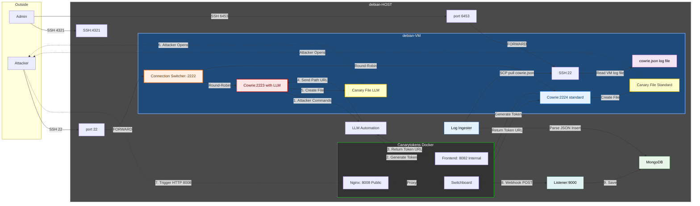

# HONEYPOT PREDICTIVE DECEPTION

An AI-powered honeypot system that uses LLM-based predictive analysis to dynamically deploy Canarytokens as traps, anticipating attacker behavior in real-time during SSH sessions.

--- 

This project implements a **predictive deception** system that enhances traditional honeypots with machine learning capabilities. When an attacker connects to the honeypot via SSH, the system:  

1. **Routes** the connection through a Connection Switcher that load-balances between two Cowrie instances
2. **Monitors** the attacker's command history in real-time
3. **Predicts** the attacker's next likely actions using a fine-tuned LLM (Gemma 3 4B and Gemma 3 12B) - only on the LLM-enabled instance
4. **Deploys** targeted Canarytokens as traps before the attacker reaches them
5. **Alerts** security teams when traps are triggered

## Architecture




### Dual Cowrie Architecture

The system employs two separate Cowrie honeypot instances managed by a Connection Switcher: 

| Component | Port | Description |
|-----------|------|-------------|
| **Connection Switcher** | 2222 | Load balancer that distributes incoming SSH connections via round-robin |
| **Cowrie with LLM** | 2223 | Full-featured honeypot with LLM-based predictive canary deployment |
| **Cowrie Standard** | 2224 | Basic honeypot that can generate canarys via wget/curl, but has **no LLM connection** |

This architecture allows for:
- **A/B testing** between LLM-enhanced and standard honeypot responses
- **Fallback capability** if the LLM service is unavailable
- **Performance comparison** between predictive and reactive canary deployment


## Repository Structure

```
honeypot_predictive_deception/
├── README.md
├── listener9000.py                    # Webhook listener for Canarytoken alerts
...  TODO when repo ok
```

## Supported Trap Types

The system can deploy various types of Canarytokens based on predicted attacker intent:

| Trap Category | Template Examples | Detection Method |
|---------------|-------------------|------------------|
| **AWS Credentials** | `AWS_CLI_DEFAULT`, `AWS_ENV_WEBAPP`, `AWS_PY_S3_UPLOADER`, `AWS_PY_LAMBDA_LEAK`, `AWS_INI_SERVICE`| AWS API monitoring |
| **Kubernetes** | `K8S_USER_DEFAULT`, `K8S_CI_PIPELINE`, `K8S_ROOT_ADMIN`, `K8S_BACKUP_OLD`, `K8S_SERVICE_ACCOUNT`  | K8s API token monitoring |
| **WireGuard VPN** | `VPN_WG_SERVER_IFACE`, `VPN_WG_MOBILE`, `VPN_WG_SEGMENTED` | VPN client activation |
| **HTTP Traps** | `TRAP_BASH_LOGROTATE`, `TRAP_PY_POSTGRES_DUMP`, `TRAP_BASH_SYSCHECK` | Script execution callback |
| **Leak Files** | `LEAK_PLAINTEXT_CREDS`, `LEAK_INFRA_INVENTORY`, `LEAK_APP_SECRETS`, `LEAK_DEV_SCRATCHPAD`, `LEAK_OPENVPN_LEGACY` | File access monitoring |
| **PDF Lures** | `LURE_CONTEXT_PHISHING`, `LURE_CONTEXT_PROJECT`, `LURE_CONTEXT_HR` | PDF reader phone-home |
| **File Substitution** | `FILE_SUBSTITUTION_HTTP` | Download detection |

---

## Installation

### Prerequisites

- Debian-based VPS with nested virtualization support
- NVIDIA L4 Gpu with 24GB vRAM
- At least 16GB RAM
- Public IP address

---

### 1. Setup of the Debian VPS (Host)

> **Note:** If using Google Cloud, you must open required ports in the GCP firewall and enable nested virtualization.  

#### 1.1 System Update and Virtualization Setup

1. Update the system:
   ```bash
   sudo apt update && sudo apt upgrade -y
   ```

2. Install QEMU/KVM + libvirt: 
   ```bash
   sudo apt install -y qemu-kvm qemu-utils libvirt-daemon-system libvirt-clients virtinst
   sudo systemctl enable --now libvirtd
   ```

3. Start and autostart the 'default' network:
   ```bash
   sudo virsh net-autostart default
   sudo virsh net-start default
   ```

4. Change the host SSH port to free up port 22 for the honeypot:
   ```bash
   sudo sed -i 's/#Port 22/Port 4321/' /etc/ssh/sshd_config
   sudo systemctl reload ssh
   ```

#### 1.2 VM Creation

5. Create the honeypot VM:  
   ```bash
   sudo virt-install \
       --virt-type kvm \
       --name vm-honeypot \
       --location https://deb.debian.org/debian/dists/bookworm/main/installer-amd64/ \
       --os-variant debian12 \
       --disk size=100 \
       --memory 8192 \
       --vcpus 6 \
       --network network=default,model=virtio \
       --graphics none \
       --console pty,target_type=serial \
       --extra-args "console=ttyS0,115200n8"
   ```

   > **Important:** During installation, ensure you install the SSH Server.  

   **VM Management Commands:**
   | Action | Command |
   |--------|---------|
   | Exit VM console | `Ctrl+]` |
   | Enter VM console | `sudo virsh console vm-honeypot` |
   | Force enter console | `sudo virsh console vm-honeypot --force` |
   | Shutdown VM | `sudo virsh shutdown vm-honeypot` |
   | Start VM | `sudo virsh start vm-honeypot` |
   | Reboot VM | `sudo virsh reboot vm-honeypot` |

6. Generate SSH keys and copy to VM:
   ```bash
   ssh-keygen -t ed25519 -f ~/.ssh/cowrie_key -N ""
   # Copy public key to VM's authorized_keys
   ```

#### 1.3 Networking and Firewall

7. Get network information:
   ```bash
   # Get public interface name (e.g., ens4)
   ip -br addr

   # Get VM IP address (e.g., 192.168.122.17)
   sudo virsh domifaddr vm-honeypot
   ```

8. Enable IP forwarding:
   ```bash
   echo 'net.ipv4.ip_forward=1' | sudo tee /etc/sysctl.d/99-ip-forward.conf
   sudo sysctl --system
   ```

9. Configure firewalld:  
   ```bash
   # Disable UFW if active
   sudo systemctl stop ufw && sudo systemctl disable ufw

   # Enable and start firewalld
   sudo systemctl enable --now firewalld

   # Configure public zone (replace ens4 with your interface)
   sudo firewall-cmd --permanent --zone=public --add-interface=ens4

   # Open required ports
   sudo firewall-cmd --permanent --zone=public --add-port=4321/tcp   # Host SSH
   sudo firewall-cmd --permanent --zone=public --add-port=9000/tcp   # Webhook listener
   sudo firewall-cmd --permanent --zone=public --add-port=6453/tcp   # VM SSH access
   sudo firewall-cmd --permanent --zone=public --add-port=8008/tcp   # Canarytoken triggers
   sudo firewall-cmd --permanent --zone=public --add-port=8082/tcp   # Canarytoken generation
   sudo firewall-cmd --permanent --zone=public --add-port=6443/tcp   # Kubeconfig tokens
   sudo firewall-cmd --permanent --zone=public --add-port=51820/udp  # WireGuard tokens

   # Enable masquerading and forwarding
   sudo firewall-cmd --permanent --zone=public --add-masquerade
   sudo firewall-cmd --permanent --zone=public --add-forward

   # Port forwarding rules (replace 192.168.122.17 with your VM IP)
   # Forward port 22 to Connection Switcher on port 2222
   sudo firewall-cmd --permanent --zone=public \
       --add-forward-port=port=22:proto=tcp:toport=2222:toaddr=192.168.122.17
   sudo firewall-cmd --permanent --zone=public \
       --add-forward-port=port=6453:proto=tcp:toport=22:toaddr=192.168.122.17

   # Libvirt zone configuration
   sudo firewall-cmd --permanent --zone=libvirt --add-port=8000/tcp  # LLM API
   sudo firewall-cmd --permanent --zone=libvirt --add-port=80/tcp    # Canary server

   # Apply changes
   sudo firewall-cmd --reload

   # Add nftables rules for VM traffic (replace handle number as needed)
   sudo nft insert rule ip filter LIBVIRT_FWI position 0 \
       oifname "virbr0" ip daddr 192.168.122.17 tcp dport 2222 ct state new accept
   sudo nft insert rule ip filter LIBVIRT_FWI position 0 \
       oifname "virbr0" ip daddr 192.168.122.17 tcp dport 2223 ct state new accept
   sudo nft insert rule ip filter LIBVIRT_FWI position 0 \
       oifname "virbr0" ip daddr 192.168.122.17 tcp dport 2224 ct state new accept
   sudo nft insert rule ip filter LIBVIRT_FWI position 0 \
       oifname "virbr0" ip daddr 192.168.122.17 tcp dport 22 ct state new accept
   ```

#### 1.4 Database Setup

10. Install MongoDB:
    ```bash
    # Follow official MongoDB installation guide for Debian:  
    # https://www.mongodb.com/docs/manual/tutorial/install-mongodb-on-debian/
    
    sudo systemctl enable --now mongod
    ```

#### 1.5 Webhook Listener AND Cowrie Log Ingestion

11. Set up the webhook listener && cowrie log ingestion service:
    > The cowrie log ingestion script polls the VM every 10 minutes and saves Cowrie logs to MongoDB. 
    ```bash
    # Install dependencies
    pip3 install flask pymongo gunicorn paramiko

    # Start the listener (production)
    ./start-canary-listener-ingester.sh

    # Or run directly for testing
    nohup python3 mongoDB/save-log-cowrie.py &
    python3 listener9000.py 
    ```

#### 1.7 Viewing Data

```bash
# Connect to MongoDB
mongosh "mongodb://localhost:27017"

# Select database
use honeypot_db

# View Canarytoken alerts
db.canary_alerts.find().sort({ _id: -1 }).limit(10)
db.canary_alerts.find({ src_ip: "x.x.x.x" })

# View Cowrie events
db.cowrie_events. find().sort({ _ingested_at: -1 }).limit(10)

# Or use the helper script
python3 view-alerts.py
```

---

### 2. Setup of Canarytokens Server

1. Install Docker and Docker Compose.  

2. Clone and configure the Canarytokens server: 
   ```bash
   git clone https://github.com/thinkst/canarytokens-docker
   cd canarytokens-docker
   cp switchboard. env. dist switchboard.env
   cp frontend.env.dist frontend.env
   ```

3. Generate WireGuard key seed:
   ```bash
   dd bs=32 count=1 if=/dev/urandom 2>/dev/null | base64
   ```

4. Edit configuration files:
   - `frontend.env`: Set `CANARY_PUBLIC_IP` and domains
   - `switchboard.env`: Configure email/webhook settings and WireGuard seed
   - `docker-compose.yml`: Adjust port mappings if needed

5. Start the services:
   ```bash
   docker compose up -d

   # View logs
   docker logs -f frontend
   docker logs -f switchboard
   ```

6. **Token URL Fix:** The generated token URLs need port 8008 appended: 
   ```python
   # This is handled automatically in honeypot.py
   result['token_url'] = result['token_url']. replace(WEBHOOK_IP, f"{WEBHOOK_IP}:8008")
   ```

**API Usage Example:**
```bash
# Supported types: web, adobe_pdf, kubeconfig, wireguard, aws_keys
curl -sS -X POST "http://192.168.122.1:8082/generate" \
  -d "memo=Honeypot_Intrusion" \
  -d "type=web" \
  -d "webhook_url=http://<YOUR_PUBLIC_IP>:9000/webhook"
```

---

### 3. Setup of AWS Keys Infrastructure

For AWS credential Canarytokens:  

1. Install Terraform and AWS CLI.  

2. Configure AWS CLI:
   ```bash
   aws configure
   # Enter:  Access Key, Secret Key, Region (e.g., us-east-2)
   ```

3. Deploy infrastructure:
   ```bash
   git clone https://github.com/thinkst/canarytokens. git
   cd canarytokens/aws-token-infra
   ```

4. Create `terraform.tfvars`:
   ```hcl
   playbook_url      = "https://example.com"
   randomised_suffix = "honeypotv1"
   slack_webhook_url = "http://<YOUR_PUBLIC_IP>: 9000/webhook"
   ticket_team       = "HoneypotAdmin"
   ticket_url        = "https://example.com"
   ```

5. Apply Terraform:
   ```bash
   terraform init
   terraform apply
   ```

6. Update `frontend.env` with the output URL: 
   ```bash
   CANARY_AWSID_URL="https://xxxxx.execute-api.us-east-2.amazonaws.com/prod/CreateUserAPITokens"
   ```

---

### 4. Setup of the Honeypot VM

#### 4.1 Connection Switcher Setup

The Connection Switcher is a load balancer that distributes incoming SSH connections between the two Cowrie instances using round-robin. 

1. Copy the connection switcher script to the VM:
   ```bash
   scp vm-with-cowrie-honeypot/connection_switcher.py cowrie@<VM_IP>:/home/cowrie/
   ```

2. Configure the Connection Switcher (edit `connection_switcher.py`):
   ```python
   # Configuration
   LISTEN_HOST = '0.0.0.0'
   LISTEN_PORT = 2222

   BACKENDS = [
       ('127.0.0.1', 2223),  # Cowrie with LLM
       ('127.0.0.1', 2224)   # Standard Cowrie (no LLM)
   ]
   ```

3. Start the Connection Switcher:
   ```bash
   python3 connection_switcher.py &
   # Or use a systemd service for production
   ```

#### 4.2 Cowrie with LLM (Port 2223)

This instance has full LLM integration for predictive canary deployment.

1. Update the system:
   ```bash
   sudo apt update && sudo apt upgrade -y
   ```

2. Install Cowrie dependencies:
   ```bash
   sudo apt install -y git python3-pip python3-venv libssl-dev libffi-dev \
       build-essential libpython3-dev python3-minimal authbind
   ```

3. Create the cowrie user and clone the repository:
   ```bash
   sudo adduser --disabled-password cowrie
   sudo su - cowrie

   git clone https://github.com/cowrie/cowrie cowrie-llm
   cd cowrie-llm
   ```

4. Set up the virtual environment:  
   ```bash
   python3 -m venv cowrie-env
   source cowrie-env/bin/activate

   pip install --upgrade pip
   pip install -e .
   
   # Install additional dependencies for LLM integration
   pip install treq pikepdf reportlab
   ```

5. Configure Cowrie to listen on port 2223:
   ```bash
   cp etc/cowrie. cfg.dist etc/cowrie.cfg
   # Edit etc/cowrie.cfg and set:
   # listen_endpoints = tcp: 2223:interface=0.0.0.0
   ```

6. **Install modified Cowrie components with LLM support** (from this repository):
   ```bash
   # Copy modified files to Cowrie installation
   cp scripts/cowrie_app/honeypot.py src/cowrie/shell/honeypot.py
   cp scripts/cowrie_app/fs. py src/cowrie/shell/fs.py
   cp scripts/cowrie_app/curl.py src/cowrie/commands/curl.py
   cp scripts/cowrie_app/wget.py src/cowrie/commands/wget.py
   cp scripts/cowrie_app/chmod.py src/cowrie/commands/chmod.py
   
   # Copy templates
   mkdir -p src/cowrie/shell/templates
   cp scripts/cowrie_app/cowrie_templates_master.json src/cowrie/shell/templates/template.json
   ```

7. Start Cowrie with LLM:
   ```bash
   bin/cowrie start
   # To stop:  bin/cowrie stop
   ```

#### 4.3 Standard Cowrie (Port 2224)

This instance is a standard Cowrie honeypot that can still generate canarys via wget/curl commands, but has **no LLM connection**.

1. Clone a separate Cowrie instance: 
   ```bash
   sudo su - cowrie
   git clone https://github.com/cowrie/cowrie cowrie-standard
   cd cowrie-standard
   ```

2. Set up the virtual environment:
   ```bash
   python3 -m venv cowrie-env
   source cowrie-env/bin/activate

   pip install --upgrade pip
   pip install -e .
   pip install treq pikepdf reportlab
   ```

3. Configure Cowrie to listen on port 2224:
   ```bash
   cp etc/cowrie.cfg.dist etc/cowrie.cfg
   # Edit etc/cowrie.cfg and set:
   # listen_endpoints = tcp:2224:interface=0.0.0.0
   ```

4. **Install modified Cowrie components WITHOUT LLM** (wget/curl canary support only):
   ```bash
   # Copy only the files needed for basic canary generation
   cp scripts/cowrie_app/fs.py src/cowrie/shell/fs.py
   cp scripts/cowrie_app/curl. py src/cowrie/commands/curl.py
   cp scripts/cowrie_app/wget.py src/cowrie/commands/wget.py
   cp scripts/cowrie_app/chmod.py src/cowrie/commands/chmod. py
   
   # Do NOT copy honeypot.py with LLM integration
   # Use the standard honeypot.py or a version with LLM disabled
   ```

5. Start Standard Cowrie:
   ```bash
   bin/cowrie start
   # To stop: bin/cowrie stop
   ```

#### 4.4 Docker Installation (Alternative)

```bash
# Create volumes for logs
docker volume create cowrie-llm-var
docker volume create cowrie-std-var

# Start Cowrie with LLM (port 2223)
docker run -d \
  --name cowrie-llm \
  -p 2223:2222 \
  -v cowrie-llm-var:/cowrie/cowrie-git/var \
  cowrie/cowrie

# Start Standard Cowrie (port 2224)
docker run -d \
  --name cowrie-standard \
  -p 2224:2222 \
  -v cowrie-std-var:/cowrie/cowrie-git/var \
  cowrie/cowrie

# View logs
docker logs -f cowrie-llm
docker logs -f cowrie-standard

# Stop and remove
docker stop cowrie-llm cowrie-standard
docker rm cowrie-llm cowrie-standard
docker volume rm cowrie-llm-var cowrie-std-var
```

> **Note:** The Docker installation requires additional configuration to integrate the LLM components and Connection Switcher.

---

### 5. LLM Server Setup

The system uses vLLM to serve the fine-tuned Gemma 3 model.  This is only used by **Cowrie: 2223** (the LLM-enabled instance).

1. Install vLLM on the host:
   ```bash
   pip install vllm
   ```

2. Start the LLM API server with one of the intended configurations
   | Model Name | Adapter Position | IP (default:  `192.168.122.1`) |
   |--------|---------|---------|
   | `gemma-3-12b-pt` | `./gemma-3-12b-pt` | `<API_SERVER_IP>`
   | `gemma-3-4b-pt` | `./gemma-3-4b-pt` | `<API_SERVER_IP>`
   | `gemma-3-4b-it` | `./gemma-3-4b-it` | `<API_SERVER_IP>`

   The provided script loads the model and the specified adapter, it loads the gemma 3 chat template from the same directory and allows the model to use up to 90% of the GPU memory.

   ```bash
   ./scripts/cowrie_app/startup_API_server.sh
   ```

   The LLM API will be available at `http://<API_SERVER_IP>:8000/v1/chat/completions`.

---

## Fine-Tuning the Model

Under the `/scripts` section there are the 3 main mutations our dataset received:  data preparation, data enrichment, data training formatting

### Dataset Preparation TODO

### Data Enrichment
The prepared dataset is further batch processed through gemma 2. 5 flash inside of a GCS environment, using Google Colab Enterprise. 
To prepare the batch job, with the intended task and system prompt (stored inside of `/scripts/batch_processing/data_distillation_prompts`) and load the augmented input inside of a GCS bucket,
run `/scripts/batch_processing/prepare_batch_gcs_output.py`.
To launch the batch job, run `/scripts/batch_processing/start_batch_work.py`

### Training 
Before the training, download the output from the GCS bucket, and parse it to a training format accustomed to the Gemma training data format.  
```bash
# First JSONL response format to single JSON response field
python3 scripts/training_processing/parse_response_toJSON.py
```
Then either run each of the other **python** scripts inside of `scripts/training_processing/` following the order:  split, parse_toJSONL, prompt_completition, sanitize_B64, sanitize_hex, collapse_hx and parse_fromPC_toText, or the single **bash** script that groups them all and does the cleanup: 
```bash
   /scripts/training_processing/run_data_processing. sh
```
Then, with the prepared dataset, the training can be launched.  It's better to run these scripts on a `tmux` to keep track of this long processing.  It's always best to run a small test to evaluate the effectiveness of the fine tuning process without wasting time and resources (`adapters/gemma-3-12-2k` is a test on a 2000 lines training subset and 500 lines evaluation subset for example).
```bash
# Using Unsloth for efficient fine-tuning
python3 scripts/training/unsloth_train_12B.py
python3 scripts/training/unsloth_train_4B_pt.py
python3 scripts/training/unsloth_train_4B_it.py
```

The trained LoRA adapters will be saved to the `adapters/` directory.

---

## How It Works

1. **Attacker connects** to port 22 (forwarded to Connection Switcher on port 2222)
2. **Connection Switcher** routes the connection via round-robin to either: 
   - **Cowrie: 2223** (with LLM integration) - predictive canary deployment
   - **Cowrie:2224** (standard) - basic canary generation via wget/curl, **no LLM**
3. **Cowrie intercepts** commands and builds a session history
4. **For Cowrie:2223 only:** Every N commands, the session history is sent to the LLM API
5. **LLM predicts** the attacker's next likely commands and intents
6. **Based on predictions**, the system: 
   - Generates appropriate Canarytokens via the API
   - Injects trap files into Cowrie's virtual filesystem
7. **For Cowrie:2224:** Canarys can still be generated when attacker uses wget/curl commands
8. **When attacker triggers a trap**, the Canarytoken server sends a webhook
9. **Webhook listener** receives the alert and stores it in MongoDB
10. **Security team** is notified of the intrusion

---

## Configuration

### Key Configuration Files

| File | Purpose |
|------|---------|
| `vm-with-cowrie-honeypot/connection_switcher.py` | Connection Switcher configuration (ports, backends) |
| `scripts/cowrie_app/honeypot.py` | LLM API URL, Canarytoken API URL, webhook IP (Cowrie:2223 only) |
| `etc/cowrie.cfg` | Cowrie configuration (separate for each instance) |
| `listener9000.py` | MongoDB connection string |
| `save-log-cowrie.py` | SSH connection to VM, polling interval |

### Environment Variables

```bash
# honeypot.py configuration (Cowrie:2223 with LLM)
URL = "http://192.168.122.1:8000/v1/chat/completions"  # LLM API
API_URL = "http://192.168.122.1:8082/generate"          # Canarytoken API
WEBHOOK_IP = "35.208.122.89"                            # Public IP for webhooks
CMD_BETWEEN_LLM_CALLS = 2                               # Commands between LLM calls

# connection_switcher.py configuration
LISTEN_PORT = 2222                                      # Connection Switcher port
BACKENDS = [('127.0.0.1', 2223), ('127.0.0.1', 2224)]  # Cowrie backends
```

---

## Troubleshooting

### Common Issues

1. **VM not accessible**:  Check firewall rules and nftables configuration
2. **LLM API timeout**: Ensure vLLM server is running and accessible from VM (only affects Cowrie:2223)
3. **Canarytokens not generating**:  Verify Docker containers are running
4. **Webhooks not received**: Check port 9000 is open and listener is running
5. **Connection Switcher not routing**: Verify both Cowrie instances are running on ports 2223 and 2224
6. **Round-robin not working**: Check Connection Switcher logs for backend connection errors

### Logs

```bash
# Connection Switcher logs (on VM)
# Outputs to stdout, use journalctl if running as systemd service

# Cowrie logs - LLM instance (on VM)
tail -f /home/cowrie/cowrie-llm/var/log/cowrie/cowrie. log

# Cowrie logs - Standard instance (on VM)
tail -f /home/cowrie/cowrie-standard/var/log/cowrie/cowrie.log

# Webhook listener logs
tail -f valid_alerts.log

# vLLM server logs
tail -f scripts/cowrie_app/vllm_server.log

# Docker container logs
docker logs -f frontend
docker logs -f switchboard
```

---

## Authors

- Leonardo Barone
- Leonardo Ciacco
- Enrico Giannini

---

## License

This project is for research and educational purposes.  See individual component licenses (Cowrie, Canarytokens) for their respective terms. 

---

## Acknowledgments

- [Cowrie SSH/Telnet Honeypot](https://github.com/cowrie/cowrie)
- [Canarytokens by Thinkst](https://github.com/thinkst/canarytokens-docker)
- [vLLM](https://github.com/vllm-project/vllm)
- [Unsloth](https://github.com/unslothai/unsloth) for efficient LLM fine-tuning
