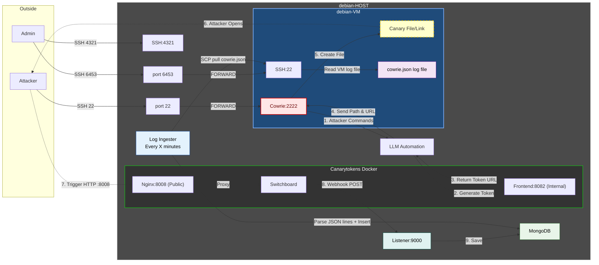

# HONEYPOT PREDECTIVE DECEPTION



## INSTALLATION

### 1. SETUP OF THE DEBIAN VPS 

> if using google workspace, you should open a new port from the official google's firewall to make the ssh work, and you hacve to enable nested virtualization  

1. update: `sudo apt update && sudo apt upgrade`
2. install QEMU/KVM + libvirt to setup the VM that will contain the honeypot.
```bash
sudo apt install -y qemu-kvm qemu-utils libvirt-daemon-system libvirt-clients virtinst
sudo systemctl enable --now libvirtd
```
4. start and autostart the 'default' network.
```bash
sudo virsh net-autostart default
sudo virsh net-start default
```
5. change ssh port to another one, e.g. 4321:
```bash
sudo vim /etc/ssh/sshd_config # change port 22 to 4321
sudo systemctl reload ssh
```
6. install and config the debian-VM:
```bash
sudo virt-install \
        --virt-type kvm \
        --name vm-honeypot \
        --location https://deb.debian.org/debian/dists/bookworm/main/installer-amd64/ \
        --os-variant generic \
        --disk size=100 \
        --memory 8192 \
        --vcpus 6 \
        --network network=default,model=virtio \
        --graphics none \
        --console pty,target_type=serial \
        --extra-args "console=ttyS0,115200n8"
```

in the host generate ssh keys, and then in the debian-VM copy the public key in the authorized_keys.

- to exit the VM: `Ctrl+]`
- to enter again in the VM: `sudo virsh console vm-honeypot`  
  (`--force` if there's already one runnin)
- to shutdown: `sudo virsh shutdown vm-honeypot`
- to start/reboot: `sudo virsh start/reboot vm-honeypot`

or you can enter via ssh on port 6453 (same ip)

7. rules to forward public:22 to VM:2222:
  - check what is your public interface: `ip -br addr`
    (e.g. ens4)
  - check the ip of the VM: `sudo virsh domifaddr vm-honeypot`  
    (e.g. 192.168.122.17)
  - remove UFW
```bash
echo 'net.ipv4.ip_forward=1' | sudo tee /etc/sysctl.d/99-sysctl.conf
sudo sysctl --system # check in /etc/sysctl.d/99-sysctl that it worked

sudo firewall-cmd --permanent --zone=public --add-interface=ens4
sudo firewall-cmd --reload

# zone public
sudo firewall-cmd --permanent --zone=public --add-port=4321/tcp   # ssh
sudo firewall-cmd --permanent --zone=public --add-port=9000/tcp   # listener for webhooks (canarytokens)
sudo firewall-cmd --permanent --zone=public --add-port=6453/tcp   # forward to the ssh of the vm that is hosting the honeypot
sudo firewall-cmd --permanent --zone=public --add-port=8008/tcp   # for when attackers open canarytokens
sudo firewall-cmd --permanent --zone=public --add-port=8082/tcp   # to generate canarytokens
sudo firewall-cmd --permanent --zone=public --add-port=6443/tcp   # kubeconfig canarytokens
sudo firewall-cmd --permanent --zone=public --add-port=51820/udp  # wireguards canarytokens
sudo firewall-cmd --permanent --zone=public --add-masquerade
sudo firewall-cmd --permanent --zone=public --add-forward
sudo firewall-cmd --permanent --zone=public --add-forward-port=port=22:proto=tcp:toport=2222:toaddr=192.168.122.17
sudo firewall-cmd --permanent --zone=public --add-forward-port=port=6453:proto=tcp:toport=22:toaddr=192.168.122.17

# zone libvirt
sudo firewall-cmd --permanent --zone=libvirt --add-port=8000/tcp    # LLM API
sudo firewall-cmd --permanent --zone=libvirt --add-port=80/tcp      # canarytokens server

sudo systemctl enable --now firewalld
sudo firewall-cmd --reload

# IMPORTANT
sudo nft insert rule ip filter LIBVIRT_FWI handle 171 oifname "virbr0" ip daddr 192.168.122.17 tcp dport 2222 ct state new accept
sudo nft insert rule ip filter LIBVIRT_FWI position 0 oifname "virbr0" ip daddr 192.168.122.17 tcp dport 22 ct state new accept
```

8. install mongodb and enable it
```bash
# first install mongodb following the guide online, then:
sudo systemctl enable --now mongod # port 27017
```

10. the script `listener9000.py` listen on port 9000 (if someone open a canarytoken on port 8000), and save it in th db. to view data:
```bash
mongosh "mongodb://localhost:27017"

use honeypot_db

# e.g...
db.canary_alerts.find().sort({ inserted_at_utc: -1 }).limit(10)
db.canary_alerts.find({ token_id: "xxx" })
db.canary_alerts.find({ source_ip: "aaa.bbb.ccc.ddd" })
```

11. the script `save-cowrie.log.py`, saves the logs of the cowrie honeypot every 10 moinuts, and save it in the db.
```bash
mongosh "mongodb://localhost:27017"

use honeypot_db
db.cowrie_events.find()
```

---

### 2. setup of canary server on the vps

1. install docker
2. install the canarytokens server: 
```bash
git clone https://github.com/thinkst/canarytokens-docker
cd canarytokens-docker
cp switchboard.env.dist switchboard.env
cp frontend.env.dist frontend.env

# generates wireguard key seed
dd bs=32 count=1 if=/dev/urandom 2>/dev/null | base64
```

modify these files:
- `frontend.env`: this will listen on port 8008 (as later setted)
- `switchboard.env`
- `docker-compose.yml`
- `common-services.yml`

4. then we can bring the whole setup up:
```bash
docker compose up # -d for detach it

#to view the logs of both frontend and switchboard:
# docker ps
docker logs -f frontend
docker logs -f switchboard
```

5. before being sended, the json have to be changed to add the port 8008:
```python
data = response.json()
canary_url = data['token_url'].replace("192.168.122.1", "192.168.122.1:8008")
```

now, some examples:
```bash
# type= {web, adobe_pdf, kubeconfig, wireguard, aws_keys}
# ip can be 192.168.122.1 or 127.0.0.1 (in this case only if you are on the host)
curl -sS -X POST "http://192.168.122.1:8082/generate" \
  -d "memo=Honeypot_Intrusion" \
  -d "type=web" \
  -d "webhook_url=http://35.208.122.89:9000/webhook"
```

examples of output of these:
- output-web: (replace the ip in token_url with {ip}:8008)
```json
[
  {
    "token": "qozzqz1s4h1dqxjcxaj3z8box",
    "hostname": "qozzqz1s4h1dqxjcxaj3z8box.35.208.122.89",
    "token_url": "http://35.208.122.89/stuff/qozzqz1s4h1dqxjcxaj3z8box/payments.js",
    "auth_token": "63a5b698e8599bae43b9dcc493d3ae01",
    "email": "",
    "webhook_url": "",
    "url_components": [
      [
        "stuff"
      ],
      [
        "payments.js"
      ]
    ],
    "error": null,
    "error_message": null,
    "Url": null,
    "token_type": "web"
  }
]
```

every output goes to a mini python server that listen to webhooks arriving in port 9000 (`listener9000.py`), and then later saves them in a mongoDB database:

---

### 3. setup of the aws keys infrastructure

1. install **terraform** and **AWS CLI** and configure a user with the policy of: ....TODO
2. run

```bash
aws configure # enter Access Key, Secret Key, Region (e.g., us-east-2)
```

3. get the infrastructure code:
```bash
git clone https://github.com/thinkst/canarytokens.git
cd canarytokens/aws-token-infra

touch terraform.tvars
```
inside `terraform.tvars`:

```bash
playbook_url = "https://google.com" # dumb value
randomised_suffix = "honeypotv1" 
slack_webhook_url = "http://35.208.122.89:9000/webhook" # the webhook that will receive the POST of the succesful canary
ticket_team = "HoneypotAdmin"
ticket_url="https://google.com" # dumb value
```

4. apply the terraform (??)

```bash
terraform apply
```
check the aws_id_url ? ..
and put it inside the variable in `~/canarytokens-docker/frontend.env`:
```bash
CANARY_AWSID_URL="https://cXXXXXX.execute-api.us-east-2.amazonaws.com/prod/CreateUserAPITokens"
```

---

### 4. SETUP OF THE DEBIAN VM

1. update the system `apt update && apt upgrade`
2. install dependencies of cowrie:
```bash
sudo apt-get install git python3-pip python3-venv libssl-dev libffi-dev build-essential libpython3-dev python3-minimal authbind
```
3. clone cowrie with _cowrie_ user
```bash
sudo adduser --disabled-password cowrie
sudo su - cowrie

git clone http://github.com/cowrie/cowrie
cd cowrie
```
4. install cowrie depencendies with pip in venv
```bash
python3 -m venv cowrie-env
source cowrie-env/bin/activate

python -m pip install --upgrade pip
python -m pip install -e .
```

5. copy defualt config:
```bash
cp etc/cowrie.cfg.dist etc/cowrie.cfg # modify it...
```

6. start it and stop it
```bash
cowrie start
cowrie stop
```
